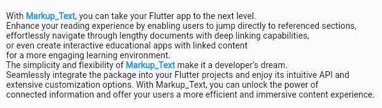

# 📌 MarkupText Widget Documentation

## 🚀 Introduction

**MarkupText** is a lightweight yet powerful Flutter widget that adds tappable, styled links within your text using simple `@{...}` markup syntax.
It supports rich interactions, custom styles, and is fully localizable and layout-friendly for both LTR and RTL languages.



---

## 🧑‍💻 Usage Guide

### 1. 📦 Installation

Add the widget file to your Flutter project or use it as a package (coming soon).

### 2. 📝 Markup Your Text

Wrap clickable words or phrases with `@{...}` to define links:

```dart
String text = "By continuing, you agree to our @{Terms of Service} and @{Privacy Policy}.";
```

### 3. 🧠 Assign Actions to Marked Text

Pass a list of `Mark` objects to define click behavior:

```dart
MarkupText(
  text: text,
  marks: [
    Mark("Terms of Service", () => print("Terms tapped")),
    Mark("Privacy Policy", () => print("Policy tapped")),
  ],
);
```

### 4. 🎨 Customize Appearance

You can style both normal and clickable text separately:

```dart
textStyle: TextStyle(
  fontSize: 14,
  color: Colors.grey[700],
),
marksStyle: TextStyle(
  fontSize: 14,
  fontWeight: FontWeight.bold,
  color: Colors.blue,
),
```

### 5. ⚙️ Control Layout

Support for layout parameters:

```dart
textAlign: TextAlign.center,
overflow: TextOverflow.ellipsis,
maxLines: 2,
textDirection: TextDirection.rtl,
```

---

## 📚 Full Example

```dart
MarkupText(
  text: "Read our @{Terms} and @{Privacy Policy}.",
  marks: [
    Mark("Terms", () => print("Terms clicked")),
    Mark("Privacy Policy", () => print("Privacy clicked")),
  ],
  textStyle: TextStyle(fontSize: 13),
  marksStyle: TextStyle(
    fontWeight: FontWeight.w600,
    color: Colors.teal,
    decoration: TextDecoration.underline,
  ),
  textAlign: TextAlign.start,
  overflow: TextOverflow.visible,
  maxLines: 3,
  textDirection: TextDirection.ltr,
)
```

---

## 🔧 Additional Info

- 💡 Developed by: **Ali Hosseini**
- 🐛 [Report issues on GitHub](https://github.com/real-ali/markup_text/issues)

Effortlessly add interactivity and visual appeal to inline text. Perfect for terms, policies, and onboarding flows!
